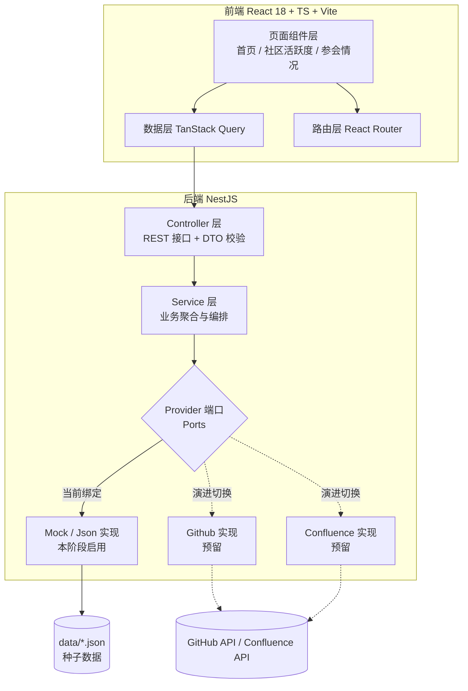

## 用户需求

设计 **OpenAN 社区运营洞察网站（OpenAN Operation Insights）** 的架构方案，产出为设计文档（不写代码、不建工程）。整体形态为「顶部导航栏 + 内容区」的后台看板式网站，导航栏包含三个一级入口：首页、社区活跃度情况、参会情况。

## 产品概览

一个面向社区运营团队的数据看板网站，用于集中呈现 OpenAN 社区的运营指标、各组织贡献度以及历次参会情况。当前阶段数据以硬编码/占位为主，但需在设计上预留真实数据源（GitHub、Confluence）的接入能力，做到后续替换数据源时页面零改动。

## 核心功能

### 1. 全局布局

- 顶部固定导航栏：左侧站点标识，中部三个导航项（首页 / 社区活跃度情况 / 参会情况），右侧辅助操作区。
- 内容区为卡片化模块，各页面之间保持统一的视觉语言与导航高亮状态。

### 2. 首页

- **核心指标卡区**：社区伙伴数量、外部开发者数量、参加的会议、已经提供的应用案例、下一次会议是什么。当前数据硬编码，卡片需支持数字强调展示。
- **贡献的组织区块**：该模块需通过向指定数据源发出请求获取，当前阶段返回占位数据，但必须走完整的前后端请求链路，并预留真实来源替换点。
- **下一次会议信息**：以高亮形式呈现最近一场会议的名称、时间、地点等要点。

### 3. 社区活跃度情况页

- 按**公司/组织**维度汇总贡献情况。
- **GitHub 类指标**：PR 数量、Issue 数量、代码量（真实来源为 GitHub，本阶段硬编码）。
- **Confluence 类指标**：需求、best-practices 案例、局点（本阶段硬编码）。
- 需支持以组织为主体查看各项指标的对比与明细。

### 4. 参会情况页

- **会议时间线**：垂直时间线，每个时间节点对应一张卡片，包含会议名称、时间、地点、官网网站，当前硬编码。
- **会议详情表格**：时间线之下，每场会议各有一张表格展示更具体的信息，除上述字段外还包含参会组织等条目，当前硬编码。

## 技术栈选型

| 层次 | 选型 | 说明 |
| --- | --- | --- |
| 前端框架 | React 18 + TypeScript + Vite | 用户指定。生态成熟，图表与时间线组件丰富 |
| 前端路由 | React Router v6 | 三个一级路由 + 可选详情路由，支持导航高亮 |
| 数据获取 | TanStack Query (React Query) | 统一管理请求缓存、加载态、错误态与重试，避免手写 useEffect 数据流 |
| 样式与组件 | Tailwind CSS + shadcn/ui | 原子化样式 + 可复制源码的组件，便于统一卡片/表格/时间线视觉 |
| 图表 | ECharts（或 Recharts） | 组织贡献排行条形图、贡献类型分布环形图 |
| 后端框架 | NestJS 10 + TypeScript | 用户指定 Node.js；选 NestJS 因其模块化 + DI 天然适配「可替换数据提供者」的诉求 |
| 数据校验 | class-validator / class-transformer | DTO 层入参校验与出参序列化 |
| 配置 | @nestjs/config | Token、仓库列表、缓存 TTL 等外置配置 |
| 缓存 | @nestjs/cache-manager（内存） | 预留，用于真实采集阶段降低外部 API 调用 |
| 外部采集（预留） | @octokit/rest（REST/GraphQL）、Confluence REST API | 本阶段仅定义端口与适配器占位 |
| 数据存储 | **JSON 文件**（data/*.json） | 用户指定。不引入数据库 |
| 文档产出 | Markdown（docs/ 目录） | 本次唯一交付物 |


## 实现策略（Implementation Approach）

### 核心思路：端口-适配器（Ports & Adapters）+ 契约优先

在 Service 之下一层定义**数据提供者端口（Provider Port）**，把「数据从哪来」与「业务如何组织」彻底解耦：

- 本阶段绑定 `Mock*Provider` / `Json*Repository` 实现，数据来自 `data/*.json`（即用户所述的硬编码内容）。
- 后续新增 `Github*Provider`、`Confluence*Provider` 实现同一端口，通过 DI Token 切换即可，**Controller、DTO、前端全部无需改动**。

### 关键决策与取舍

1. **硬编码数据统一后置到后端 JSON 文件，前端不写死任何 fixture。**

- 理由：用户明确「贡献的组织」需要走请求，其余硬编码。若一部分走接口、一部分写死在前端组件里，后续接入真实数据时会出现两套数据路径，前端需要返工。
- 方案：前端所有数据一律经 HTTP 获取；后端从 `data/*.json` 读取种子数据返回。前端代码从第一天起就是「最终形态」，替换数据源只是后端换一个 Provider 绑定。
- 取舍：初版多一层后端读取开销，但换来零返工成本，收益远大于成本。

2. **契约按真实数据源的字段设计，而不是按 Mock 数据的字段设计。**

- GitHub 维度字段对齐真实 API 语义（`login`、`avatar_url`、`html_url`、`merged_prs`、`issues`、`additions/deletions` 汇总得到的 `lines_changed`），避免接入时字段改名导致前后端连锁修改。

3. **JSON 文件持久化采用「Repository 接口 + 原子写」。**

- 读：启动时或按需读取 + 内存缓存，避免每次请求重复 IO。
- 写：写临时文件后 `rename` 原子替换；写入操作用串行队列（Promise 链）避免并发写导致文件损坏。
- 每个文件携带 `schemaVersion` 与 `updatedAt`，读取时做结构校验，校验失败降级为只读并告警。

4. **不引入新的架构范式。** 后端沿用 NestJS Module → Controller → Service → Provider 的既有分层；前端沿用 Vite 标准目录 + 路由分层，不做过度抽象。

### 性能与可靠性

- **开发阶段**：JSON 文件读取走内存缓存，接口响应为 O(1) 内存读，无性能瓶颈。
- **真实采集阶段（设计预留）**：GitHub REST 限流 5000 req/h，采用「ETag 条件请求 + 按 `since` 增量拉取 + 服务端 TTL 缓存」三层防护；组织级贡献统计使用 GraphQL 批量查询，**避免按仓库逐个请求造成 N+1**。贡献聚合按仓库批量拉取后一次性归并，复杂度由 O(组织数 × 仓库数) 降为 O(仓库数)。
- **前端**：TanStack Query 统一处理去重、缓存与失效，避免同一数据在多个组件重复请求；表格与图表数据使用 `useMemo` 派生，避免渲染期重复遍历。

### 实现注意事项（Execution Details）

- **日志**：沿用 NestJS `Logger`，分 level 输出。严禁在日志中打印 GitHub Token、Confluence 凭据；采集失败日志只输出仓库/接口标识与状态码，不 dump 完整响应体。
- **配置与安全**：Token 仅通过环境变量注入，前端永不接触任何凭据（所有外部调用均在后端完成）。DTO 层做白名单校验，拒绝未知字段。
- **影响范围控制**：本次仅新增 `docs/` 下的设计文档，不触碰任何既有代码（当前工作区为空），无回归风险。
- **接口演进**：所有响应统一包裹 `{ code, message, data }`，便于后续加分页、加错误码时不破坏前端解析。

## 架构设计



**演进路径**：Mock(JSON 文件) → JSON 落库与人工维护 → 定时采集 + 缓存 + 数据版本管理。三个阶段的 Controller 契约与前端代码完全一致。

## 目录结构

### A. 本次交付物（设计文档，需实际创建）

```
openan-operation-insights/
└── docs/
    ├── README.md                        # [NEW] 文档总索引。说明文档目的、阅读顺序、各文档职责边界与术语表（社区伙伴、外部开发者、局点、best-practice 案例等），并标注本阶段「硬编码/占位」范围与后续演进承诺。
    ├── 01-architecture-overview.md      # [NEW] 架构总览。包含：分层架构图（Mermaid）、技术选型与理由、端口-适配器设计原则、部署形态（Vite 静态产物 + NestJS 服务 + JSON 文件目录）、环境与配置约定、命名规范、以及目标工程目录结构约定（仅约定，不落地）。
    ├── 02-frontend-design.md            # [NEW] 前端设计。包含：三页面路由表、每页区块拆解与字段级清单、组件树与复用关系（Navbar、指标卡、组织卡片墙、时间线、详情表格、骨架屏/空态/错误态）、TanStack Query 的 queryKey 与缓存策略约定、多语言与主题（浅色/深色）方案、响应式断点规则。
    ├── 03-backend-design.md             # [NEW] 后端设计。包含：NestJS 模块划分（home / activity / meeting / common）、Controller-Service-Provider 各层职责、Provider 端口接口签名与 DI Token 命名、JSON Repository 读写与原子写/串行队列机制、DTO 与统一响应包装、异常过滤器与错误码表、日志规范、缓存与限流预留方案、配置项清单（env 变量）。
    ├── 04-data-and-api-contract.md      # [NEW] 数据模型与接口契约。包含：各 JSON 文件的 schema（字段名/类型/必填/示例）、按真实数据源语义设计的实体定义（Organization、GithubContribution、ConfluenceInsight、HomeMetric、Meeting、MeetingDetail）、完整 REST 接口清单（路径、方法、查询参数、请求/响应示例、分页约定、错误码）、以及 Mock 种子数据样例。
    └── 05-integration-roadmap.md        # [NEW] 数据接入演进路线。包含：GitHub 采集设计（REST vs GraphQL 选型、ETag/增量/限流应对、组织与仓库清单配置方式、代码量统计口径）、Confluence 采集设计（空间/页面/CQL 检索、字段映射）、采集调度与缓存策略、数据校验与回滚、分阶段里程碑与验收标准。
```

### B. 文档中约定的目标工程结构（供后续实现参考，本次不创建）

```
openan-operation-insights/
├── docs/                          # 本阶段交付物
├── data/                          # JSON 数据文件：home.json / organizations.json / contributions.json / insights.json / meetings.json
├── apps/
│   ├── web/                       # React + TS + Vite
│   │   └── src/{pages,components,features,lib,types}
│   └── api/                       # NestJS
│       └── src/{modules,common,providers,repositories,config}
└── package.json                   # monorepo 工作区（可选，亦可前后端独立目录）
```

## 关键接口定义

端口抽象是本方案可替换性的核心，需在文档中精确定义：

```ts
/** 组织贡献数据端口：Mock 实现与 GitHub 实现共用 */
export interface ContributionPort {
  /** 获取组织列表（含基础信息） */
  listOrganizations(params: ListOrganizationsQuery): Promise<Organization[]>;
  /** 获取指定时间范围内的组织贡献聚合指标 */
  getContributions(params: {
    orgIds?: string[];
    from?: string; // ISO 8601
    to?: string;   // ISO 8601
  }): Promise<OrganizationContribution[]>;
}

/** 归一化后的组织贡献指标（字段对齐真实数据源语义，避免二次返工） */
export interface OrganizationContribution {
  orgId: string;
  orgName: string;
  logoUrl: string;        // 对应 GitHub avatar_url
  homepageUrl: string;    // 对应 GitHub html_url
  github: {
    pullRequests: number; // 已合并 PR 数
    issues: number;       // Issue 数
    linesChanged: number; // additions + deletions 汇总
  };
  confluence: {
    requirements: number; // 需求
    bestPractices: number;// best-practice 案例
    deployments: number;  // 局点
  };
  updatedAt: string;
}
```

`MeetingPort`、`HomeMetricPort` 采用同样的定义方式（当前由 JSON 种子数据实现），文档中一并给出签名约定。

## 设计风格

采用「现代数据看板 + 轻玻璃拟态」风格：以浅色为默认主题并提供深色模式。大面积留白配合卡片化模块，卡片圆角 16px、柔和多层阴影、边框为 1px 半透明白。核心视觉记忆点由蓝—青渐变强调色承担，用于指标数字、时间线节点与关键按钮。

布局上导航栏固定吸顶，内容区最大宽度 1280px 居中，模块间距 24px；数据密集区域使用表格与图表的组合而非堆砌卡片。微动效保持克制：卡片悬浮上浮 2px 并加深阴影、指标数字入场滚动计数、时间线节点随滚动依次淡入。

## 页面规划（共 3 个页面）

### 1. 首页

- **顶部导航栏**：左侧 OpenAN 标识与副标题，中部三项导航（首页/社区活跃度/参会情况）当前项高亮下划线，右侧深色模式切换与 GitHub 入口。
- **核心指标卡区**：5 张等宽卡片横向排列（社区伙伴数量、外部开发者数量、参加的会议、应用案例、下一次会议），大号渐变数字配趋势角标，悬停上浮。
- **贡献的组织区块**：组织卡片墙，每张卡含 Logo、组织名、贡献类型标签；由接口返回，加载时展示骨架屏，空数据展示引导态。
- **下一次会议横幅**：通栏渐变背景，突出会议名称、时间、地点与「查看官网」按钮。
- **页脚**：版权信息与数据更新时间。

### 2. 社区活跃度情况

- **顶部导航栏**：保持一致的吸顶导航与高亮状态。
- **筛选概览栏**：时间范围选择与组织多选筛选，右侧提供导出按钮。
- **贡献排行榜**：横向条形图展示组织 PR/Issue/代码量对比，可切换指标维度。
- **贡献类型分布**：环形图呈现 PR、Issue、需求、best-practice 案例、局点五类占比，中心显示总量。
- **贡献明细表格**：组织 × 五类指标矩阵，表头支持排序，行内展示组织 Logo 与名称。

### 3. 参会情况

- **顶部导航栏**：同上，当前页高亮。
- **会议时间线**：垂直时间线，节点圆点用渐变强调色，每张卡片含会议名称、时间、地点与官网链接，支持按年份筛选。
- **会议详情区**：每场会议一张独立表格，字段含会议名称、时间、地点、官网、参会组织、参会人数、议程要点与成果。
- **锚点跳转条**：顶部年份/会议快速锚点，点击平滑滚动至对应卡片。
- **页脚**：与首页一致，展示数据更新时间。

## 交互与响应式

- 表格支持列排序与横向滚动；图表切换维度时带 300ms 过渡动画。
- 断点：≥1280px 五列指标卡，768–1279px 三列，<768px 单列堆叠；表格在小屏下转为卡片列表。
- 所有异步区块统一具备加载态（骨架屏）、空态与错误重试态。

## Agent Extensions

### Skill

- **docx**
- Purpose: 将 Markdown 架构设计文档汇总导出为格式规范的 Word 文档，便于在企业内部评审、流转与归档。
- Expected outcome: 生成一份包含标题层级、目录、表格与 Mermaid 图说明文字的 `.docx` 架构设计说明书，内容与 docs/ 下 Markdown 文档保持一致。