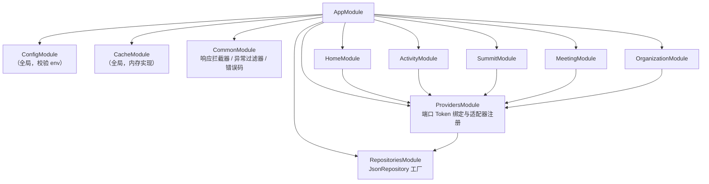
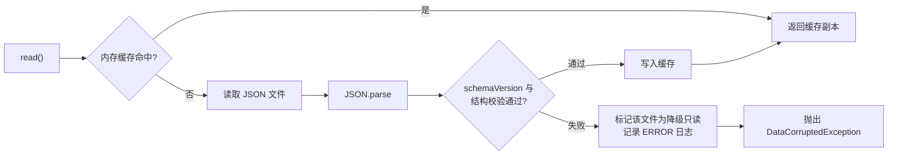
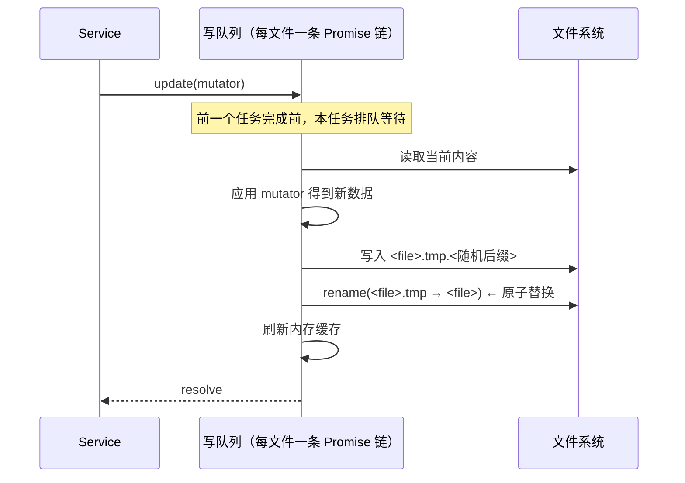
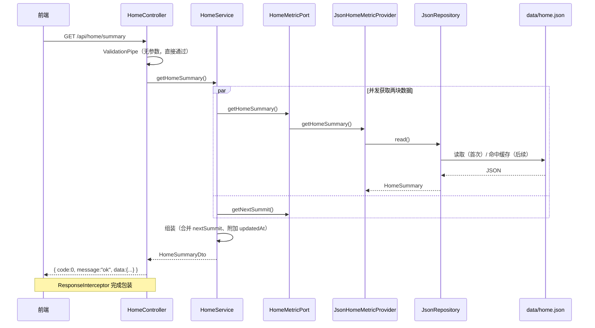

# 03 · 后端设计

> 依赖文档：`01-architecture-overview.md`
> 适用范围：`apps/api`（NestJS 10 + TypeScript）

---

## 1. 技术栈与依赖清单

| 分类 | 依赖 | 用途 |
| --- | --- | --- |
| 框架 | `@nestjs/core`、`@nestjs/common`、`@nestjs/platform-express` | 应用骨架（默认 Express 适配器，便于 Vite 代理与轻量部署） |
| 配置 | `@nestjs/config` | 环境变量加载、校验与类型化访问 |
| 校验 | `class-validator`、`class-transformer` | DTO 白名单校验与类型转换 |
| 缓存（预留） | `@nestjs/cache-manager`、`cache-manager` | 阶段三外部采集结果缓存（**尚未引入**） |
| 日志 | NestJS 内置 `Logger` | 结构化日志输出 |
| 外部调用 | 原生 `fetch`（**未引入 `@octokit` 等 SDK**） | `collector/` 直接调用 GitHub GraphQL，减少依赖面与版本维护成本 |
| 文件 IO | Node `fs/promises` | JSON 仓储读写 |

---

## 2. 模块划分

### 2.1 模块结构



### 2.2 模块职责表

| 模块 | 控制器 | 服务 | 依赖的端口 | 说明 |
| --- | --- | --- | --- | --- |
| `HomeModule` | `HomeController` | `HomeService` | `HOME_METRIC_PORT`、`ORGANIZATION_PORT`、`SUMMIT_PORT` | 聚合首页指标、下次峰会、贡献组织概览 |
| `OrganizationModule` | `OrganizationController` | `OrganizationService` | `ORGANIZATION_PORT`、`CONTRIBUTION_PORT` | 组织档案与筛选 |
| `ActivityModule` | `ActivityController` | `ActivityService` | `CONTRIBUTION_PORT`、`INSIGHT_PORT` | 贡献明细、成果洞察、贡献聚合 |
| `SummitModule` | `SummitController` | `SummitService` | `SUMMIT_PORT` | 峰会列表、时间线、详情 |
| `MeetingModule` | `MeetingController` | `MeetingService` | `MEETING_ATTENDANCE_PORT` | 例会参会矩阵（**纯透传**，无口径计算） |
| `ProvidersModule` | — | — | — | 集中声明所有端口 Token → 适配器类的绑定；当前六个端口**恒为 JSON 实现**，采集不经此切换（见 2.3 节） |
| `RepositoriesModule` | — | — | — | 提供 `JsonRepository<T>` 实例（按文件名注入） |
| `CommonModule` | — | — | — | 全局响应拦截器、异常过滤器、错误码枚举 |

> **设计意图**：把"端口 → 适配器"的绑定集中到 `ProvidersModule`，使业务模块（Home / Activity / Summit）只依赖端口、对数据来源无感知。
>
> **重要修正（读写分离）**：外部数据采集**不通过本模块切换**。按"采集写、接口读"的设计（见 `05-integration-roadmap.md` 2.5 节），`src/collector` 是唯一写入 `data/*.json` 的入口，API 请求链路永远只读本地落盘文件，因此 `CONTRIBUTION_PORT` / `INSIGHT_PORT` **恒为 JSON 实现**，不存在 `GithubContributionProvider` 之类的第二套适配器。本模块的绑定能力保留给另一类场景：未来更换存储实现（如 PostgreSQL），或确需 API 链路直连上游实时查询时。

### 2.3 关键文件清单约定

```text
apps/api/src/
├── main.ts                          # 全局 ValidationPipe / Filter / Interceptor / CORS
├── app.module.ts
├── config/
│   ├── configuration.ts             # 环境变量 → 配置对象
│   └── env.validation.ts            # 启动期 env 校验（必填项缺失即启动失败）
├── common/
│   ├── interceptors/response.interceptor.ts
│   ├── filters/all-exceptions.filter.ts
│   ├── constants/error-code.ts
│   └── dto/api-response.dto.ts
├── repositories/
│   ├── json-repository.ts           # 泛型仓储：读缓存 + 原子写 + 串行队列
│   └── repositories.module.ts
├── providers/
│   ├── ports/                       # ★ 端口接口定义（纯接口，无实现）
│   │   ├── home-metric.port.ts
│   │   ├── organization.port.ts
│   │   ├── contribution.port.ts
│   │   ├── insight.port.ts
│   │   ├── summit.port.ts
│   │   └── meeting-attendance.port.ts
│   ├── tokens.ts                    # 所有 DI Token 常量
│   ├── json/                        # 当前唯一实现（读 data/*.json）
│   └── providers.module.ts          # 端口 → 适配器绑定（换存储 / 直连上游时才动）
├── collector/                       # ★ 采集器：独立 Nest 上下文，不启动 HTTP 服务
│   ├── main.ts                      # CLI 入口（--mode=auto|incremental|full、--dry-run）
│   ├── collector.module.ts          # 采集上下文装配，与 AppModule 解耦
│   ├── collector.tokens.ts          # GITHUB_SOURCE 注入 Token（真实 / 离线可切换）
│   ├── collector.constants.ts       # 分页、限流阈值、请求间隔等常量
│   ├── contribution-collector.service.ts   # 记录按 orgId 归并后写入 contributions.json
│   ├── github-source.types.ts       # GithubSource 抽象与记录类型
│   ├── graphql-github.source.ts     # 真实实现（原生 fetch 调 GitHub GraphQL）
│   ├── fixture-github.source.ts     # 离线实现（GITHUB_FIXTURE，无 token 自检用）
│   └── sync-state.store.ts          # data/.sync-state.json 游标读写
├── scripts/                         # 辅助脚本（import-meetings.ts：xlsx → meetings.json）
└── modules/
    ├── home/
    ├── organization/
    ├── activity/
    ├── summit/
    └── meeting/
```

---

## 3. 分层职责与调用约定

| 层 | 职责 | 严格禁止 |
| --- | --- | --- |
| Controller | 绑定查询参数到 DTO、调用 Service、返回数据对象（由拦截器包装） | 读写文件、调用外部 API、业务口径计算 |
| Service | 口径计算、多源合并、排序、过滤、分页裁剪 | 出现 `fs`、`fetch`、`@octokit` 等具体实现引用；出现 `data/*.json` 文件名 |
| Provider Port | 声明方法签名与返回类型（纯 TypeScript interface） | 包含任何实现细节或框架装饰器 |
| Provider Adapter | 实现端口：读取数据、字段映射、缓存读写 | 包含业务口径计算（应放在 Service） |

**调用链**：`Controller → Service → (Port → Adapter → Repository) → 返回`。

---

## 4. 端口（Port）定义

以下为**接口签名约定**，是业务层与数据源之间的稳定边界。

### 4.1 组织与贡献端口

```ts
// providers/ports/organization.port.ts
export interface ListOrganizationsQuery {
  /** 按组织类型过滤 */
  type?: OrganizationType;
  /** 按名称模糊匹配 */
  keyword?: string;
}

export interface Organization {
  orgId: string;          // 稳定主键，kebab-case
  name: string;           // 展示名
  logoUrl: string;        // 对应 GitHub avatar_url
  homepageUrl: string;    // 对应 GitHub html_url
  type: 'partner' | 'external' | 'community' | 'individual'; // individual = 独立开发者伪组织
  tags: string[];         // 如 ['伙伴单位','芯片']
  aliases?: Record<string, string>; // { github: 'xxx', confluence: 'yyy' }
}

export interface OrganizationPort {
  listOrganizations(q: ListOrganizationsQuery): Promise<Organization[]>;
  getOrganizationById(orgId: string): Promise<Organization | null>;
}
```

> `scope` 是 HTTP 接口层参数（`GET /api/organizations`），由 `OrganizationService` 组合贡献数据实现（`contributing` = 全量组织 + 贡献分 + 降序，见 ADR-0001），不属于 Port 的查询条件。

```ts
// providers/ports/contribution.port.ts
export interface ContributionQuery {
  orgIds?: string[];
  from?: string;  // ISO 8601
  to?: string;    // ISO 8601
}

/** GitHub 维度贡献（字段对齐真实 API 语义，避免二次返工） */
export interface OrganizationContribution {
  orgId: string;
  orgName: string;
  logoUrl: string;
  homepageUrl: string;
  github: {
    pullRequests: number; // 已合并 PR 数
    issues: number;       // Issue 数
    linesChanged: number; // additions + deletions 汇总
    repos: number;        // 参与仓库数
  };
  updatedAt: string;
}

export interface ContributionPort {
  getContributions(q: ContributionQuery): Promise<OrganizationContribution[]>;
}
```

### 4.2 Confluence 洞察端口

```ts
// providers/ports/insight.port.ts
export interface InsightQuery {
  orgIds?: string[];
  from?: string;
  to?: string;
}

/** Confluence 维度贡献 */
export interface OrganizationInsight {
  orgId: string;
  orgName: string;
  logoUrl: string;
  confluence: {
    requirements: number;  // 需求
    bestPractices: number; // best-practice 案例
  };
  updatedAt: string;
}

export interface InsightPort {
  getInsights(q: InsightQuery): Promise<OrganizationInsight[]>;
}
```

### 4.3 首页指标端口

```ts
// providers/ports/home-metric.port.ts
export interface MetricValue {
  value: number;
  unit?: string;
  /** 环比变化，可选 */
  delta?: number;
  deltaDirection?: 'up' | 'down' | 'flat';
}

export interface HomeSummary {
  partnerCount: MetricValue;            // 社区伙伴数量
  externalDeveloperCount: MetricValue;  // 外部开发者数量
  summitCount: MetricValue;            // 参加的峰会
  useCaseCount: MetricValue;            // 已提供的应用案例
  nextSummit: SummitSummary | null;   // 下一次峰会
  updatedAt: string;
}

export interface HomeMetricPort {
  getHomeSummary(): Promise<HomeSummary>;
}
```

### 4.4 峰会端口

```ts
// providers/ports/summit.port.ts
export interface SummitQuery {
  year?: number;
  includeDetail?: boolean;
  /** 仅返回未结束的峰会 */
  upcomingOnly?: boolean;
}

export interface SummitSummary {
  id: string;
  name: string;
  startDate: string;      // ISO 8601
  endDate: string;        // ISO 8601
  location: string;
  websiteUrl: string;
  isUpcoming: boolean;
}

export interface SummitDetail extends SummitSummary {
  host: string;
  attendeeCount: number;
  attendingOrganizations: string[];
  agendaHighlights: string[];
  outcomes: string[];
  minutesUrl?: string;
}

export interface SummitPort {
  listSummits(q: SummitQuery): Promise<SummitSummary[]>;
  getSummitById(id: string): Promise<SummitDetail | null>;
  getNextSummit(): Promise<SummitSummary | null>;
}
```

### 4.5 例会参会矩阵端口

```ts
// providers/ports/meeting-attendance.port.ts
/** 例会参会矩阵：行 = 日期，列 = 人名（照搬 Excel 台账，见 ADR-0005） */
export interface MeetingAttendanceRow {
  date: string;          // YYYY-MM-DD
  attendance: boolean[]; // 与 columns 等长、同序；true = 出席
}

export interface MeetingAttendanceMatrix {
  columns: string[];            // 人名原文（非主键）
  rows: MeetingAttendanceRow[]; // 保持台账原序
  updatedAt?: string;
}

export interface MeetingAttendancePort {
  getMatrix(): Promise<MeetingAttendanceMatrix>;
}
```

> 该端口是**纯透传**：Service 不做任何排序、聚合与补全（ADR-0005）。个人出席率与每场出席人数由**前端**派生（02 §6.3），后端不计算。

### 4.6 DI Token 与绑定切换

```ts
// providers/tokens.ts
export const HOME_METRIC_PORT = Symbol('HOME_METRIC_PORT');
export const ORGANIZATION_PORT = Symbol('ORGANIZATION_PORT');
export const CONTRIBUTION_PORT = Symbol('CONTRIBUTION_PORT');
export const INSIGHT_PORT = Symbol('INSIGHT_PORT');
export const SUMMIT_PORT = Symbol('SUMMIT_PORT');
export const MEETING_ATTENDANCE_PORT = Symbol('MEETING_ATTENDANCE_PORT');
```

```ts
// providers/providers.module.ts（更换存储实现 / 确需直连上游时才改此文件）
@Global()
@Module({
  providers: [
    // ── 六个端口恒为 JSON 实现 ──────────────────
    // 采集不走端口切换：collector 写 data/*.json，API 只读本地落盘文件
    { provide: HOME_METRIC_PORT,  useClass: JsonHomeMetricProvider },
    { provide: ORGANIZATION_PORT, useClass: JsonOrganizationProvider },
    { provide: CONTRIBUTION_PORT, useClass: JsonContributionProvider },
    { provide: INSIGHT_PORT,      useClass: JsonInsightProvider },
    { provide: SUMMIT_PORT,       useClass: JsonSummitProvider },
    { provide: MEETING_ATTENDANCE_PORT, useClass: JsonMeetingAttendanceProvider },
  ],
  exports: [HOME_METRIC_PORT, ORGANIZATION_PORT, CONTRIBUTION_PORT, INSIGHT_PORT, SUMMIT_PORT, MEETING_ATTENDANCE_PORT],
})
export class ProvidersModule {}
```

> **为什么没有 GitHub / Confluence 适配器**：本架构**不采用**"为真实数据源再写一套 Port 适配器"的方案。真实数据源由 `src/collector` 采集后落盘为与种子数据**完全相同**的 JSON 结构，API 读到的内容与阶段一别无二致——这正是"契约不变、前端与业务层零改动"的实现方式，同时避免了"端口适配器"与"采集器"两条并行数据路径（见 `05-integration-roadmap.md` 1.2 节约束 1 与 4）。
>
> **可替换性验收标准**：若"更换数据来源"需要修改 `modules/` 下任何一个文件的代码，则视为架构被破坏。按当前口径，更换数据来源（人工维护 → 采集脚本 → 定时采集）**只改变写入方，API 代码零改动**。

### 4.7 Provider 实现规范

- 端口方法必须是 `async`，即使 JSON 实现是同步可得的（保证接口一致，未来换成网络请求不改变签名）。
- 适配器内部**只做数据获取与字段映射**，不抛业务异常；数据缺失返回空数组或 `null`。
- 适配器**不得**直接 `import fs`，必须通过注入的 `JsonRepository<T>` 访问文件，以便统一处理缓存与原子写。

---

## 5. JSON 仓储设计（`JsonRepository<T>`）

存储层是本期唯一的"持久化"部件，需要特别设计以规避 JSON 文件的固有缺陷（并发写损坏、无 schema 约束、无索引）。

### 5.1 接口约定

```ts
// repositories/json-repository.ts
export interface JsonFileEnvelope<T> {
  schemaVersion: number;
  updatedAt: string;
  data: T;
}

export interface JsonRepository<T> {
  /** 读取（优先命中内存缓存，缓存未命中则读文件并解析校验） */
  read(): Promise<JsonFileEnvelope<T>>;
  /** 全量写入（原子写 + 串行队列），写入后刷新缓存 */
  write(data: T): Promise<void>;
  /** 局部更新（读出 → 变更函数 → 原子写），队列内串行执行避免丢失更新 */
  update(mutator: (current: T) => T): Promise<void>;
  /** 强制丢弃缓存，下次 read 重新读盘 */
  invalidate(): void;
}
```

### 5.2 文件划分与用途

| 文件 | 承载实体 | 写入频率 | 规模预估 |
| --- | --- | --- | --- |
| `data/home.json` | `HomeSummary`（首页指标 + `nextSummitId`） | 极低 | 1 条记录 |
| `data/organizations.json` | `Organization[]` | 低 | 数十条 |
| `data/contributions.json` | `OrganizationContribution[]` | 低（阶段三为定时采集） | 数十条 |
| `data/insights.json` | `OrganizationInsight[]` | 低 | 数十条 |
| `data/summits.json` | `SummitDetail[]` | 极低 | 十余条 |
| `data/meetings.json` | `MeetingAttendanceMatrix` | 极低（运营手动触发导入） | 1 个矩阵（约数十行 × 数十列） |

> `nextSummit` 在 `home.json` 中只存 `nextSummitId` 引用，实际峰会对象由 `SummitProvider` 提供，避免同一峰会数据两处维护导致不一致。

### 5.3 读取路径（含缓存）



**要点**：
- 返回**深拷贝**（`structuredClone`）而非缓存对象引用，防止调用方意外修改污染缓存。
- 缓存以文件为单位（key = 文件名），启动时不预热，首次请求懒加载。
- 校验失败**不静默返回残缺数据**，而是抛出明确的业务异常（见错误码 `DATA_CORRUPTED`），由前端展示"数据维护中"。

### 5.4 写入路径（原子写 + 串行队列）

JSON 文件写入有两大风险：**半写损坏**与**并发丢失更新**。对策如下：



1. **原子写**：先写同目录下的临时文件，`fs.rename` 覆盖目标文件。POSIX 与 Windows 上 `rename` 均为原子操作，保证任何时刻磁盘上的文件要么是旧的完整内容，要么是新的完整内容，不存在半截 JSON。
2. **串行队列**：每个文件维护一条 `Promise` 链，`update()` 调用被追加到链尾并 `await` 前序任务。这消除了"读到旧值 → 各自写入 → 后者覆盖前者"的丢失更新问题。
3. **写入即刷新缓存**：写成功后立即更新内存缓存，避免后续读命中过期数据。
4. **失败处理**：写失败时清理临时文件、**不更新缓存**、抛出 `DATA_WRITE_FAILED`，并在日志中记录文件路径与错误原因（不记录完整数据内容）。

> **本期写入场景极少**（数据由人工维护 JSON 或后续采集任务落盘），但仍按上述规范实现，因为阶段三引入定时采集后写入频率会显著上升。

### 5.5 存储层可替换性

`JsonRepository` 实现的是通用仓储语义。若后续数据量增长需要迁移到 PostgreSQL，只需：

1. 新增 `PrismaRepository<T>` 实现同一接口；
2. 修改 `RepositoriesModule` 的绑定。

`providers/` 与 `modules/` 均无需改动。

---

## 6. DTO 与统一响应

### 6.1 DTO 设计规范

| 规范 | 说明 |
| --- | --- |
| 命名 | `<动作><资源>QueryDto`，如 `ListSummitsQueryDto` |
| 白名单 | DTO 类上启用 `@IsOptional()` / `@IsString()` 等，并配合全局 `whitelist: true`、`forbidNonWhitelisted: true` 拒绝未知参数 |
| 类型转换 | 开启 `transform: true` + `enableImplicitConversion: true`，使 `?year=2026` 自动转为 `number` |
| 枚举约束 | 年份、scope、排序字段使用 `@IsIn([...])` 限定取值范围 |
| 分页参数 | `page`（默认 1，最小 1）、`pageSize`（默认 20，最大 100），均带 `@Type(() => Number)` |

示例：

```ts
export class ListSummitsQueryDto {
  @IsOptional() @Type(() => Number) @IsInt() @Min(2000) @Max(2100)
  year?: number;

  @IsOptional() @IsIn(['true', 'false'])
  includeDetail?: string;

  @IsOptional() @IsIn(['true', 'false'])
  upcomingOnly?: string;
}
```

> `GET /api/meetings` **无查询参数**（原样透传矩阵，ADR-0005），因此无需对应的 `QueryDto`。

### 6.2 统一响应信封

所有成功响应经全局拦截器包装为：

```json
{
  "code": 0,
  "message": "ok",
  "data": { }
}
```

| 字段 | 类型 | 说明 |
| --- | --- | --- |
| `code` | number | `0` 表示成功；非 0 见第 7 节错误码表 |
| `message` | string | 面向调用方的简短说明，成功为 `"ok"` |
| `data` | any | 业务数据；无数据时为 `null` |

**分页响应** `data` 结构：

```json
{
  "items": [],
  "total": 0,
  "page": 1,
  "pageSize": 20
}
```

**实施方式**：`ResponseInterceptor` 检查返回值是否为已包装对象（以 `code` 属性 + 特定符号标记），避免重复包装；`@Raw()` 装饰器可跳过包装（本期不需要，为健康检查等预留）。

> **约定**：HTTP 状态码仍如实返回（200/400/404/500），业务错误在 `code` 中细化。前端 `apiClient` 以 HTTP 层正常为前提下再判 `code`。

---

## 7. 异常处理与错误码

### 7.1 异常过滤器

`AllExceptionsFilter` 捕获所有异常并统一输出：

```json
{
  "code": 40001,
  "message": "参数 year 必须是 2000 到 2100 之间的整数",
  "data": null
}
```

处理顺序：

1. `HttpException` 及其子类（含 `ValidationPipe` 抛出的 `BadRequestException`）→ 映射为对应业务错误码，提取校验消息数组并拼接为可读文案。
2. 自定义业务异常（`DomainException`，携带 `ErrorCode`）→ 直接使用其 code 与 message。
3. 未预期异常 → 记录 `ERROR` 级日志（含堆栈与请求上下文），对外仅返回 `50000 / "服务内部错误"`，**不泄漏堆栈与内部路径**。

### 7.2 错误码表

| code | HTTP | 常量 | 含义 | 前端建议处理 |
| --- | --- | --- | --- | --- |
| `0` | 200 | `OK` | 成功 | — |
| `40000` | 400 | `BAD_REQUEST` | 通用参数错误 | 提示 `message` |
| `40001` | 400 | `VALIDATION_FAILED` | DTO 校验未通过 | 提示 `message` |
| `40002` | 400 | `INVALID_DATE_RANGE` | `from` 晚于 `to` 或格式非法 | 提示并重置筛选 |
| `40003` | 400 | `INVALID_YEAR` | 年份超出允许范围 | 重置筛选 |
| `40400` | 404 | `RESOURCE_NOT_FOUND` | 通用资源不存在 | 展示空态 |
| `40401` | 404 | `ORGANIZATION_NOT_FOUND` | 组织不存在 | 展示空态 + 返回列表 |
| `40402` | 404 | `SUMMIT_NOT_FOUND` | 峰会不存在 | 展示空态 + 返回时间线 |
| `50000` | 500 | `INTERNAL_ERROR` | 未预期错误 | 展示错误态 + 重试 |
| `50001` | 500 | `DATA_CORRUPTED` | JSON 文件结构/版本校验失败 | 展示"数据维护中" |
| `50002` | 500 | `DATA_WRITE_FAILED` | 数据写入失败 | 提示重试 |
| `50003` | 503 | `UPSTREAM_UNAVAILABLE` | 外部数据源不可用（阶段三） | 展示缓存数据 + 提示"数据可能不是最新" |
| `50004` | 429 | `UPSTREAM_RATE_LIMITED` | 外部数据源限流（阶段三） | 同上，并延后重试 |

> 前端只需识别 `0`（成功）与错误分类（4xxxx 用户可修正 / 5xxxx 系统问题），无需为每个码写分支逻辑。

---

## 8. 日志规范

| 项 | 规范 |
| --- | --- |
| 工具 | NestJS 内置 `Logger`，按模块创建上下文：`new Logger(HomeService.name)` |
| 级别 | `error`（影响功能）、`warn`（可降级）、`log`（关键流程）、`debug`（开发期细节，生产关闭） |
| 请求日志 | 记录 `method`、`path`、`status`、`durationMs`；**不记录**请求体全文与查询串完整值（避免敏感信息） |
| 数据访问 | 记录文件名与记录条数，如 `loaded contributions.json (23 records)`，**不 dump 内容** |
| 外部调用（`collector/`） | 记录目标资源标识与状态码（如 `GET /repos/openan/x/pulls → 200`），**严禁**记录 Token、Authorization 头、完整响应体 |
| 异常日志 | 未预期异常记录完整堆栈与请求上下文（路径、参数键名），不回传客户端 |
| 禁止项 | 任何凭据、个人身份信息、完整数据文件内容 |

---

## 9. 缓存与限流

| 机制 | 设计 | 说明 |
| --- | --- | --- |
| 服务端缓存 | `CacheModule`（内存实现），key 形如 `contrib:${orgIds}:${from}:${to}`，TTL 默认 `CACHE_TTL_SECONDS=300` | 与 `JsonRepository` 内存缓存叠加；数据来自本地文件，收益有限，按需启用（**尚未引入依赖**） |
| 缓存穿透 | 空结果也缓存（短 TTL），避免重复读取文件 | — |
| 缓存击穿 | 同一 key 的并发请求合并为一次文件读取（Promise 复用） | 配合 Repository 串行队列 |
| 上游限流 | **不由请求链路触发**：配额预检、串行间隔与指数退避全部实现在采集任务内 | 详见 `05-integration-roadmap.md` 2.5 节与 `src/collector` |
| 降级 | API 侧不存在上游调用，读取的始终是最近一次成功落盘的 JSON；数据陈旧状态由采集器写入的 `.sync-state.json` 体现 | 前端据此提示"数据可能不是最新" |

---

## 10. 配置项清单

`config/configuration.ts` 汇总，`env.validation.ts` 在启动期校验必填项，缺失即**启动失败**（fail-fast）。

| 变量 | 必填 | 默认 | 说明 |
| --- | --- | --- | --- |
| `PORT` | 否 | `3000` | HTTP 监听端口 |
| `NODE_ENV` | 否 | `development` | 运行环境 |
| `DATA_DIR` | 否 | `<repo>/data` | JSON 数据目录绝对/相对路径 |
| `MEETINGS_SOURCE_PATH` | 否 | `data/source/meetings.xlsx` | 例会台账源文件路径（**仅供采集脚本使用，API 不读取**） |
| `CORS_ORIGINS` | 否 | `http://localhost:5173` | 允许来源，逗号分隔；同域部署可留空 |
| `CACHE_TTL_SECONDS` | 否 | `300` | 缓存有效期 |
| `LOG_LEVEL` | 否 | `log` | 日志级别 |
| `GITHUB_TOKEN` | 否（阶段三必填） | — | GitHub 个人访问令牌，需 `repo:read` 权限 |
| `GITHUB_ORGS` | 否 | — | 待采集组织，逗号分隔 |
| `GITHUB_REPOS` | 否 | — | 可选，显式指定仓库白名单 |
| `GITHUB_LOOKBACK_DAYS` | 否 | `3650` | **兜底**回溯窗口；仅当本地游标缺失/损坏时生效，正常增量以 `lastSyncAt` 为准 |
| `CONFLUENCE_BASE_URL` | 否 | — | Confluence 站点地址 |
| `CONFLUENCE_TOKEN` | 否 | — | Confluence API Token |
| `CONFLUENCE_SPACES` | 否 | — | 待采集空间 Key，逗号分隔 |

**安全约定**：`.env` 必须加入 `.gitignore`；仓库提供 `.env.example` 只含键名与注释，不含真实值。

---

## 11. 关键请求时序

以首页为例（阶段一，数据来自 JSON 文件）：



**要点**：Service 内部使用 `Promise.all` 并发获取相互独立的数据块，避免串行等待；任一数据块缺失时降级为 `null`/空数组而非整体失败（首页指标缺失则整块隐藏，不影响其他区块）。

---

## 12. 可测试性与质量保障

| 层次 | 测试方式 | 重点用例 |
| --- | --- | --- |
| Provider 适配器（JSON） | 单元测试 + 临时目录 fixture | 文件缺失、schema 版本不匹配、字段类型错误 |
| JsonRepository | 单元测试 | 原子写是否正确替换、并发 `update` 是否丢失更新、缓存是否失效 |
| Service | 单元测试（注入内存版 Port） | 口径计算（如 `linesChanged` 汇总）、空数据处理、日期区间过滤、排序稳定性 |
| 例会矩阵透传 | 单元测试 | `attendance.length !== columns.length` 时抛 `DATA_CORRUPTED`；返回结果保持原序、不被加工 |
| Controller | e2e 测试（`supertest`） | 参数校验拒绝未知字段、错误码正确、响应信封结构 |
| 契约一致性 | 类型级校验 | Service 返回类型与 04 文档契约字段逐项对齐（Code Review 清单） |

**测试替身约定**：`InMemoryContributionProvider` 等内存实现放在 `test/` 下，**不得**进入 `providers/` 目录，避免与生产适配器混淆。

---

## 13. 后端设计自检清单

在实现完成后，逐项确认以下条款，任一项不满足即视为偏离架构：

- [ ] `modules/` 下没有任何 `fs`、`fetch`、`@octokit` 直接引用
- [ ] 所有数据访问都经由 Provider 端口，端口实现由 `ProvidersModule` 统一声明
- [ ] 采集链路（`src/collector`）与请求链路完全解耦：API 侧不引用任何外部 API 客户端，只读本地 JSON
- [ ] `modules/` 下不含任何端口绑定逻辑，绑定集中于 `ProvidersModule`
- [ ] 所有 Controller 返回值经 `ResponseInterceptor` 统一包装，无手写 `{ code, message, data }`
- [ ] 所有异常经 `AllExceptionsFilter` 统一处理，错误码取自 `ErrorCode` 枚举
- [ ] `ValidationPipe` 开启 `whitelist` + `forbidNonWhitelisted` + `transform`
- [ ] JSON 写入使用临时文件 + `rename` 原子替换，且按文件串行
- [ ] 日志中不含任何凭据与完整数据内容
- [ ] 启动期校验 `DATA_DIR` 存在且七个 JSON 文件结构合法
