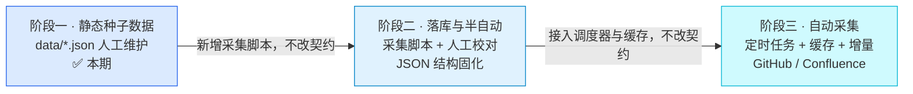
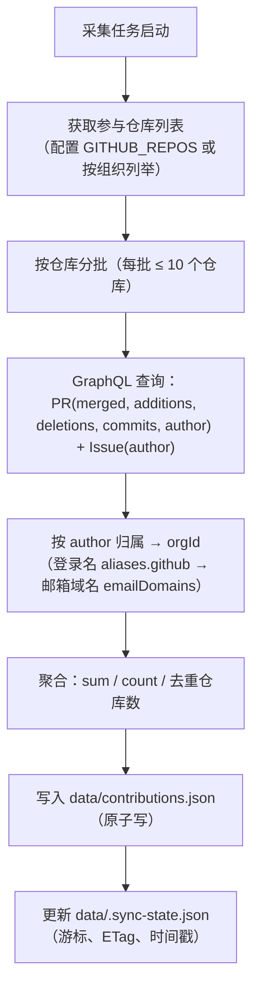
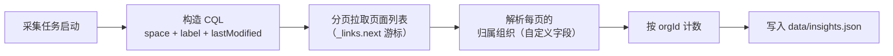
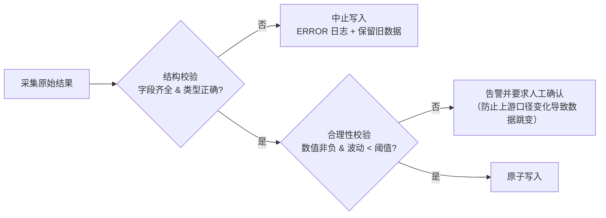
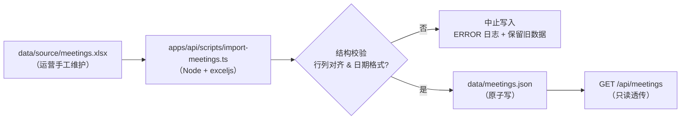

# 05 · 数据接入演进路线

> 依赖文档：`04-data-and-api-contract.md`
> 定位：定义从「JSON 种子数据」到「真实数据源自动采集」的演进路径，确保每一步都不破坏既有契约。

---

## 1. 演进总览



### 1.1 三阶段定义

| 阶段 | 数据来源 | 触发方式 | 对契约影响 | 对前端影响 |
| --- | --- | --- | --- | --- |
| **阶段一**（本期） | `data/*.json` 人工维护 | 无（静态） | — | — |
| **阶段二** | 采集脚本写入 JSON | 手动执行 / 本地脚本 | **无**（写入同一文件结构） | **无** |
| **阶段三** | GitHub / Confluence API 采集 + 落盘缓存 | 定时任务（Cron） | **无**（采集器内映射后落盘） | **无** |

> **核心承诺**：三个阶段之间，**契约（04 文档）不变，前端代码不变**。API 侧的六个端口**始终绑定 JSON 实现**——变化的只是「谁往 `data/*.json` 写数据」：阶段一手工维护、阶段二采集脚本、阶段三定时采集任务。业务层与请求链路全程零改动。例会参会数据（见第 10 节）是这一模型的**首个真实落地样本**：`data/source/meetings.xlsx` → 采集脚本 → `data/meetings.json`，而接口与前端自始至终只读 JSON。

### 1.2 演进的关键约束

1. 采集结果必须落盘到与阶段一**完全相同**的 JSON 结构，否则阶段二无法作为阶段三的降级兜底。
2. 任何新增的采集元信息（如采集时间、ETag、游标）存放在**独立的 `data/.sync-state.json`** 中，**不污染**业务数据文件。
3. 采集失败时服务必须可用——降级返回最近一次成功落盘的数据，并标记 `X-Data-Stale: true`。
4. **采集器与 API 是两个独立的运行上下文**：采集器 `apps/api/src/collector` 不启动 HTTP 服务，API（`AppModule`）也不引用任何外部 API 客户端。因此"接入真实数据源"不体现为端口实现的替换，而是"谁负责写 `data/*.json`"的替换——三阶段的差异全部收敛在写入侧。
5. 例会参会数据的**源台账是 Excel**（`data/source/meetings.xlsx`），只有落盘产物 `data/meetings.json` 属于契约（04 §3.8）；台账本身**不是契约文件**，接口不读取、前端不可见。

---

## 2. GitHub 采集设计

### 2.1 采集目标与映射

| 目标字段 | GitHub 来源 | 说明 |
| --- | --- | --- |
| `orgId` | 配置表（组织映射） | 不由 GitHub 推导，避免组织名大小写/改名导致主键漂移 |
| `orgName` | 配置表 | 展示名由人工维护 |
| `logoUrl` | 用户/组织 `avatar_url` | 直接从 API 响应取 |
| `homepageUrl` | 用户/组织 `html_url` | 同上 |
| `github.repos` | 参与的仓库去重计数 | 由 PR/Issue 记录中的仓库集合推导 |
| `github.pullRequests` | Search API 或 GraphQL `search` | 仅统计 merged |
| `github.commits` | PR `commits.totalCount` | **PR 级汇总**；与 merged 口径同源，嵌套查询零额外请求 |
| `github.issues` | Search API 或 GraphQL | 提出或参与 |
| `github.linesChanged` | PR `additions + deletions` | **PR 级汇总**；GraphQL 列表响应即含该字段，无需逐文件统计 |

### 2.2 REST vs GraphQL 选型

| 维度 | REST（GitHub REST API） | GraphQL（GitHub GraphQL API） |
| --- | --- | --- |
| 获取"某组织某人的 PR 列表" | 需按仓库逐个请求，**N+1 明显** | 一次查询跨多个仓库，可精确指定字段 |
| 获取 PR 的 `additions/deletions` | 列表接口**不含**该字段，需逐个 PR 详情请求 | 列表即可返回 `additions`/`deletions` |
| 分页 | `Link` 头 + page 参数 | Cursor 分页，更稳定 |
| 限流计量 | 按请求数 | **按节点数**（成本可预估、可优化） |
| 调试成本 | 低 | 中（需维护查询语句） |

**决策**：**以 GraphQL 为主，REST 为补充**。

- GraphQL 用于：按组织/仓库批量拉取 PR 与 Issue 列表**并同时取到 `additions`/`deletions`**，一次请求覆盖多个仓库，彻底消除 N+1。
- REST 用于：GraphQL 不便表达的场景（如需要 `Search API` 的复杂限定符组合），以及获取用户/组织基本信息。

**通道分工（规避搜索结果上限）**：

| 场景 | 通道 | 理由 |
| --- | --- | --- |
| 日常**增量** | `search`（限定 `mergedAt > lastSyncAt`） | 结果量小，一次覆盖全部仓库，成本低 |
| 每周**全量对账** | **逐仓库遍历** `repository.pullRequests(states: MERGED)` | 搜索类接口存在**单查询最多返回 1000 条结果**的硬上限，且该上限**与账号权限/等级无关**（换高权限账号、GitHub App、企业账号均不提高）；逐仓库翻页无此限制 |

> 增量侧仍用 `search` 的 `total_count` 作为**安全阀**：当 `total_count ≥ 1000` 时记录告警，提示"增量结果可能被截断，应改用逐仓库遍历"。



### 2.3 代码量统计口径

`linesChanged` 的口径必须在契约中锁定，避免不同实现口径漂移成为争议点：

| 决策点 | 结论 | 理由 |
| --- | --- | --- |
| 取数口径 | **PR 级汇总**：直接累加 PR 的 `additions + deletions` | 与 GitHub PR 页面 `+N −M` 逐 PR 可对账；GraphQL 列表响应即含该字段 |
| 是否包含删除行 | **包含**（`additions + deletions`） | 反映真实改动规模 |
| 是否排除二进制/生成代码 | **不排除** | PR 级字段无法区分文件类型；文件级过滤须逐 PR 拉取 files 详情，配额与耗时不可接受 |
| 是否排除文档 | **不排除** | 文档贡献同样属于社区贡献 |
| 是否按 merge commit 去重 | **是** | 以 PR 为唯一计数单位，一个 PR 只在其 `mergedAt` 时点计入一次 |
| 增量策略 | 按 `mergedAt > lastSyncAt` 拉取 | 避免每次全量重算 |

**提交数（`github.commits`）口径**：与 `linesChanged` 同源——逐条累加**已合并 PR** 的 `commits.totalCount`（PR 内提交总数），**不含未经 PR 直接推送到分支的提交**。理由：① 与 `pullRequests` / `linesChanged` 口径一致（同属同一批已合并 PR，可互相印证）；② `totalCount` 与 `additions` / `deletions` 在同一层嵌套查询一并返回，**不产生任何额外请求**；③ 若统计仓库全部提交，须逐仓库翻页遍历提交历史（`defaultBranchRef.target.history`），配额与耗时不可接受，且直推提交的作者多数无 login 关联、归属信号弱。

> **性能提示**：GraphQL 节点成本与返回字段数正相关。全量首采可能消耗较多配额，应安排在夜间执行并限制并发；后续增量采集仅为少量新 PR，成本极低。

### 2.4 增量采集与 ETag

| 机制 | 用途 | 实现要点 |
| --- | --- | --- |
| 时间游标 `lastSyncAt`（**单游标制**） | 只拉取新增/变更数据 | 存于 `.sync-state.json`，每次成功后推进。**全量优先**：首次采集不设时间下限、拉取全部历史；此后增量严格取 `mergedAt > lastSyncAt`。`GITHUB_LOOKBACK_DAYS` 仅在游标**缺失/损坏**时作为兜底回溯窗口 |
| `ETag` 条件请求 | REST 场景下避免返回未变更内容 | 存 `If-None-Match` → `304` 时跳过处理，**304 请求不消耗配额** |
| 全量对账 | 修正历史数据漂移 | 每周一次全量重算（或手动触发），用于纠正漏采 |
| 幂等写入 | 重复采集不产生重复记录 | 以 `(orgId)` 为唯一键整体替换该组织的贡献对象，而非追加 |

### 2.5 限流应对

GitHub 对认证请求的配额约为 **5000 请求/小时**（REST）与**5000 节点/小时**（GraphQL）。

| 层次 | 策略 |
| --- | --- |
| 请求前 | 检查 `X-RateLimit-Remaining` / GraphQL `rateLimit.remaining`，低于安全阈值（如 500）则**中止本轮采集**并保留上次数据 |
| 请求中 | 串行 + 固定间隔（如 120ms），避免瞬时并发触发二级限流 |
| 响应处理 | 遇 `403`/`429` 且 `X-RateLimit-Reset` 存在时，记录重置时间并延后重试（指数退避 + 抖动） |
| 结果上限 | 搜索类接口**单查询最多返回 1000 条**结果（**与账号权限无关**，不因刷新或升级账号而提高）。全量对账一律走**逐仓库遍历**；增量采集用 `total_count ≥ 1000` 检测并告警 |
| 请求后 | 全部结果落盘缓存，**业务请求链路绝不直接调用 GitHub**（只读本地落盘数据） |
| 兜底 | 采集失败不清空数据；响应附加 `X-Data-Stale: true` |

**关键设计**：**读写分离**——采集任务负责写，API 请求只负责读。这样即使 GitHub 完全不可用，看板依然可用（展示最后一次成功采集的数据）。

### 2.6 组织与仓库配置

```env
GITHUB_TOKEN=ghp_xxxxxxxx
GITHUB_ORGS=openan-labs,nova-silicon
GITHUB_REPOS=
GITHUB_LOOKBACK_DAYS=3650
```

| 配置项 | 语义 |
| --- | --- |
| `GITHUB_ORGS` | 组织白名单。用于自动枚举这些组织下参与过 PR/Issue 的**外部作者**，再按 `aliases.github`（登录名）或 `emailDomains`（邮箱域名）归属到 `orgId` |
| `GITHUB_REPOS` | 仓库白名单。为空时自动枚举 `GITHUB_ORGS` 下的全部仓库；配置后仅采集列表内仓库，**用于收窄统计口径** |
| `GITHUB_LOOKBACK_DAYS` | **兜底回溯窗口**：仅在 `.sync-state.json` 游标缺失/损坏时生效；正常增量以 `lastSyncAt` 为准。默认值应 ≥ 全量历史跨度（如 3650 天） |

**组织归属映射**（`data/organizations.json` 中的 `aliases.github` 与 `emailDomains`）：

```json
{
  "orgId": "nova-silicon",
  "name": "NovaSilicon",
  "aliases": { "github": "nova-silicon", "confluence": "NovaSilicon 技术团队" },
  "emailDomains": ["novasilicon.com"]
}
```

映射流程（按优先级从高到低）：

1. 从 API 响应取作者 `login`（如 `nova-silicon-bot`），并采集邮箱信号：**PR 首个提交的作者邮箱**（`commits.nodes[0].commit.author.email`）优先，缺失时退化为账户**公开资料邮箱**（`User.email`）；
2. 在 `organizations.json` 中查找 `aliases.github` 精确匹配项；
3. 未匹配到 → 用邮箱域名匹配 `emailDomains`（精确优先，其次按 `.域名` 后缀匹配子域，如 `mail.novasilicon.com` 命中 `novasilicon.com`）；
4. 仍未匹配到 → 归类为**独立开发者**（`orgId = "unattributed"` 伪组织），在首页以**独立卡片**展示（人数 + 贡献量），并把未匹配的 `login` 记入 `.sync-state.json` 的 `unattributedLogins[]`，供运营人工补充映射；
5. 匹配到 → 累加到对应 `orgId`。

> **邮箱信号的两个来源**：`@users.noreply.github.com` 等非组织域名不命中任何 `emailDomains`，自然落入独立开发者；邮箱**仅用于内存判定，不写入任何数据文件**；同一贡献者的全部记录（含其 Issue）共用同一邮箱信号（两遍聚合：先按 `login` 汇总邮箱，再统一归属）；人工在 `contributors.json` 中已指定的 `orgId` 不会被自动判定覆盖；多个组织配置相同域名时按档案顺序先到先得并输出 `WARN`。

> **这是全流程中最容易出错的一环**。建议在阶段二先导出作者 login 清单，人工确认映射后再进入阶段三。

---

## 3. Confluence 采集设计

### 3.1 采集目标与映射

| 目标字段 | Confluence 来源 | 说明 |
| --- | --- | --- |
| `confluence.requirements` | 指定空间下带 `需求` 标签的页面数 | 按页面标签或页面属性过滤 |
| `confluence.bestPractices` | 带 `best-practice` 标签的页面数 | 标签命名需在配置中约定 |
| `orgId` | 页面创建者 / 自定义字段"归属组织" | 优先取显式字段，避免依赖创建者推断 |

### 3.2 检索方案

Confluence REST API 支持 CQL（Confluence Query Language）按标签、空间、时间检索：

```text
space in ("OPENAN") and label in ("需求") and lastmodified >= "2026-06-18"
```



| 要点 | 设计 |
| --- | --- |
| 标签约定 | 预先在 Confluence 中约定 `需求` / `best-practice` 两个标签，采集器只认标签 |
| 空间约定 | 通过 `CONFLUENCE_SPACES` 限定空间，避免误采集其他团队文档 |
| 归属解析 | 优先读页面的自定义字段（如"所属组织"）；缺失时退化为按页面创建者映射，并在日志中记 `WARN` |
| 增量 | 使用 `lastmodified >= lastSyncAt`，与 GitHub 采样游标策略一致 |
| 认证 | 使用 API Token（Basic Auth）或 PAT（Bearer），存于 `CONFLUENCE_TOKEN` |

### 3.3 与 GitHub 采集的差异

| 维度 | GitHub | Confluence |
| --- | --- | --- |
| 限流 | 明确配额（5000/h），需主动管理 | 无公开硬配额，但仍需串行与退避 |
| 分页 | Cursor / Link 头 | `_links.next` 游标 |
| 数据形态 | 天然结构化（PR/Issue） | 半结构化，依赖标签与自定义字段约定 |
| 主要风险 | 限流、作者归属 | **标签与字段约定不落实**，导致采集为空 |

> **前置动作**：进入阶段三前，必须与社区运营确认 Confluence 的标签与"所属组织"字段已规范化落地，否则采集器无论怎么写都拿不到数据。

---

## 4. 采集调度与缓存

### 4.1 调度策略

| 任务 | 频率 | 说明 |
| --- | --- | --- |
| GitHub 增量采集 | 每 6 小时 | 拉取 `mergedAt > lastSyncAt` 的 PR 与新增 Issue |
| GitHub 全量对账 | 每周一次（周日 02:00） | 重算全部历史，纠正漏采与口径漂移 |
| Confluence 增量采集 | 每 12 小时 | 按 `lastmodified` 增量 |
| 缓存预热 | 服务启动时 | 读取全部 JSON 到内存，避免首请求冷启动延迟 |
| 例会台账导入 | 运营更新台账后手动触发 | `npm run collect:meetings`，全量重算矩阵（无游标） |

**实现方式**：本期不引入外部调度器，使用 `@nestjs/schedule` 的 `@Cron` 装饰器；后续如需横向扩展再迁移到独立 Worker。

### 4.2 缓存层次

| 层次 | 位置 | TTL | 作用 |
| --- | --- | --- | --- |
| L1 数据文件缓存 | 后端内存（`JsonRepository`） | 直到写入失效 | 消除磁盘 IO |
| L2 接口响应缓存 | 后端 `CacheModule` | 300s | 削峰，避免高频重复聚合 |
| L3 浏览器缓存 | 前端 TanStack Query | 5–30 min（按数据类型） | 减少请求数 |
| L4 HTTP 缓存 | `Cache-Control` 响应头 | 60s | 网关与浏览器层 |

**缓存键设计**：`<数据类型>:<orgIds排序后拼接>:<from>:<to>`，保证参数顺序不同时命中同一缓存。

### 4.3 并发与冲突控制

- 采集任务与 API 读取**不在同一进程内竞争**：采集通过 `JsonRepository.update()` 排队写入，API 读取命中内存缓存，互不阻塞。
- 采集任务加**互斥锁**（进程内 `boolean` 标志 + 启动时间戳），防止上一次未结束就触发下一次。
- 采集任务超时上限设为 10 分钟，超时后中止并保留上次数据。

---

## 5. 数据校验、版本与回滚

### 5.1 采集结果校验（写入前）



| 校验类型 | 规则 | 失败处理 |
| --- | --- | --- |
| 结构校验 | 必填字段存在、类型正确、`orgId` 在组织档案中可解析 | 中止写入 |
| 数值校验 | 所有计数 ≥ 0；`linesChanged` ≥ 0 | 中止写入 |
| 波动校验 | 与上次值相比，单次变化超过阈值（如 ±50%）时告警 | **仍然写入**但标记 `hasAnomaly`，等待人工确认 |
| 空值校验 | 全部组织贡献均为 0 → 视为采集异常 | 中止写入，保留旧数据 |
| 矩阵校验（例会） | `attendance.length === columns.length`、`date` 匹配 `YYYY-MM-DD`、`columns` 非空 | 中止写入，保留旧数据 |

> **波动校验的意义**：GitHub/Confluence 的口径或查询条件一旦被误改，最直观的表现就是数据突然暴涨或归零。此校验是防止"错误数据污染看板"的最后一道防线。

### 5.2 版本与回滚

| 机制 | 设计 |
| --- | --- |
| 数据快照 | 每次写入前将旧文件复制为 `data/.snapshots/<文件名>.<时间戳>.json`，保留最近 7 份 |
| 回滚操作 | 将任意快照复制回原文件名即可（原子写），无需改代码 |
| 变更记录 | `.sync-state.json` 记录每次采集的 `startedAt`/`finishedAt`/`status`/`records`/`error` |
| schema 演进 | 结构不兼容时提升 `schemaVersion`，加载器保留对旧版本的兼容读取（至少一个迭代周期） |

### 5.3 `.sync-state.json` 结构

```json
{
  "github": {
    "lastSyncAt": "2026-09-18T06:00:00Z",
    "lastFullSyncAt": "2026-09-14T02:00:00Z",
    "etags": { "repos/openan-labs/core": "\"a1b2c3\"" },
    "rateLimitRemaining": 4380,
    "status": "success",
    "unattributedLogins": ["some-user", "another-dev"]
  },
  "confluence": {
    "lastSyncAt": "2026-09-18T00:00:00Z",
    "status": "success"
  }
}
```

> 该文件**不属于业务契约**，前端不可见，可随时删除（删除后触发全量采集）。

### 5.4 离线自检（无需 token）

采集器提供不依赖 `GITHUB_TOKEN` 的端到端自检：以固定记录（`apps/api/scripts/fixtures/github-records.sample.json`）作为采集源，配合**配套合成种子**（`apps/api/scripts/fixtures/seed-data/`）在系统临时目录跑**真实落盘**，校验全量替换 / 增量叠加 / 幂等 / 伪组织补齐 / 邮箱域名归属等不变量，结束后清理临时目录。

```bash
npm run build -w @openan/api
npm run collect:check -w @openan/api   # 期望输出：33/33 通过
```

- 合成种子刻意与仓库 `data/` 解耦：真实 `data/` 会随每次线上采集而变化，若直接作为校验输入，断言将随数据漂移而失效；脚本结尾会逐字节比对，确认真实 `data/` 与种子均未被改动。
- 固定记录中的 `commitEmail`（PR 首提交作者邮箱）与 `author.email`（账户公开资料邮箱）**仅用于内存归属判定**，脚本会断言其未出现在任何落盘文件中。
- 覆盖的归属场景：登录名别名精确命中、提交邮箱子域命中（`mail.novasilicon.com` → `novasilicon.com`）、公开资料邮箱兜底、提交邮箱优先于资料邮箱、`@users.noreply.github.com` 不误判。

---

## 6. 安全与凭据管理

| 要求 | 措施 |
| --- | --- |
| 凭据存储 | 仅存于后端环境变量（`.env`，已 `gitignore`）；生产使用密钥管理服务注入 |
| 最小权限 | GitHub Token 仅授予 `public_repo`（公开仓库读）或按需 `repo`（私有仓库读）；Confluence Token 仅授予目标空间的读权限 |
| 前端隔离 | 前端不接触任何凭据；`VITE_` 前缀变量严禁存放密钥 |
| 日志脱敏 | 禁止打印 `Authorization` 头、Token 值、完整响应体；仅记录资源标识与状态码 |
| 传输安全 | 全部使用 HTTPS；校验 TLS 证书 |
| 数据出境 | 采集结果仅落盘到本地 JSON，不向第三方回传 |
| 审计 | `.sync-state.json` 保留采集轨迹，便于追溯数据来源与时点 |

---

## 7. 里程碑与验收标准

### M1 · 阶段一交付（本期）

| 项 | 验收标准 |
| --- | --- |
| 文档 | `docs/` 下五篇文档齐备且相互引用一致 |
| 数据 | 七个 JSON 文件结构符合 04 文档，`schemaVersion = 1` |
| 契约 | 所有接口路径、字段、错误码与 04 文档逐项对齐 |
| 可替换性 | 业务模块无任何数据源引用；API 只读本地 JSON，采集链路（`collector/`）与请求链路完全解耦 |
| 例会台账 | `data/source/meetings.xlsx` 可经 `npm run collect:meetings` 生成结构合法的 `data/meetings.json`；脚本失败时保留旧数据 |

### M2 · 实现落地（下一迭代）

| 项 | 验收标准 |
| --- | --- |
| 前端 | 四个页面按 02 文档渲染完成，全部数据来自接口，无前端硬编码业务数据 |
| 后端 | 九个接口全部可用，响应信封统一，错误码符合 03 文档 |
| 数据 | 首页四项指标、组织贡献、峰会时间线与详情、例会参会矩阵均可正常展示 |
| 质量 | 单元测试覆盖 Service 口径计算与 `JsonRepository` 并发写场景 |
| 性能 | 页面接口本地响应 P95 < 100ms（不含网络） |

### M3 · 阶段二（半自动）

| 项 | 验收标准 |
| --- | --- |
| 采集脚本 | 可手动执行，输出结构完全等于 04 文档定义的 JSON |
| 映射 | 已产出作者 login ↔ `orgId` 映射清单并经运营确认 |
| 降级 | 脚本失败时服务仍可用，展示旧数据 |

### M4 · 阶段三（自动采集）

| 项 | 验收标准 |
| --- | --- |
| 调度 | GitHub 每 6 小时、Confluence 每 12 小时自动采集成功 |
| 限流 | 连续 7 天无因限流导致的采集中断 |
| 缓存 | 采集结果落盘并可被 API 读取；浏览器端无重复请求 |
| 校验 | 结构/数值/波动三类校验生效，异常时保留旧数据并告警 |
| 回滚 | 可在 5 分钟内通过快照回滚到任意一次采集结果 |
| 前端 | **前端与阶段一代码完全一致，无任何改动** |

---

## 8. 风险登记表

| # | 风险 | 影响 | 概率 | 应对措施 | 责任方 |
| --- | --- | --- | --- | --- | --- |
| R1 | 组织在 GitHub / Confluence 命名不一致，贡献无法归并 | 数据失真 | 高 | `aliases` 映射表 + 未匹配贡献归入独立开发者伪组织 + 阶段二人工作业 | 后端 + 运营 |
| R2 | Confluence 标签与"所属组织"字段未规范落地 | 采集结果为空 | 高 | 进入阶段三前先完成标签规范；采集器对空结果告警 | 运营 |
| R3 | GitHub 限流导致采集中断 | 数据不更新 | 中 | 增量采集 + 配额预检 + 读写分离（API 只读落盘数据） | 后端 |
| R4 | 上游口径变更导致数据跳变 | 看板误导决策 | 中 | 波动校验 + 快照回滚 + UI 标注数据更新时间 | 后端 |
| R5 | `linesChanged` 全量采集成本高 | 首采耗时长/耗配额 | 中 | 分仓库分批 + 夜间执行 + PR 级汇总（不做文件级过滤） | 后端 |
| R6 | JSON 文件被并发写损坏 | 服务不可用 | 低 | 原子写 + 串行队列 + 启动校验 + 降级只读 | 后端 |
| R7 | 数据文件未持久化，容器重启丢失更新 | 数据回退 | 中 | 部署强制挂载持久化卷 + 定期备份 | 运维 |
| R8 | 组织贡献含敏感商业信息 | 合规风险 | 低 | 仅采集公开仓库与公开页面；私有数据不入库 | 运营 + 安全 |
| R9 | 搜索结果超 1000 条被静默截断（与账号权限无关） | 数据少算 | 中 | 全量对账改逐仓库遍历；增量侧 `total_count ≥ 1000` 告警 | 后端 |
| R10 | 例会台账列名不一致（改名 / 重名 / 空格）产生重复列 | 出席率静默算错；接 Zoom 需重建映射 | 中 | 运营保证列名一致；ADR-0005 标记为已知负债；接 Zoom 前先补 `personId` | 运营 + 后端 |

---

## 9. 附录：演进决策速查

| 决策 | 结论 | 核心理由 |
| --- | --- | --- |
| 前端是否硬编码数据 | 否，全部走后端接口 | 避免阶段三前端全面返工 |
| 存储选型 | JSON 文件 + Repository 抽象 | 规模小、零依赖、可平滑替换 |
| 后端框架 | NestJS | DI 容器让实现可替换；读写分离让采集与请求解耦 |
| GitHub 主用 API | GraphQL 为主、REST 为辅 | 消除 N+1，一次拿到 `additions/deletions` |
| 采集与读取关系 | 读写分离（采集写、接口读） | 上游不可用时看板仍可用 |
| 增量策略 | 全量优先 + 单游标（`lastSyncAt`）+ 每周全量对账；`LOOKBACK_DAYS` 仅兜底 | 兼顾成本、时效与准确性 |
| 采集通道 | 增量 `search` + 全量逐仓库遍历 | 规避单查询 1000 条结果硬上限（与账号权限无关） |
| `linesChanged` 口径 | PR 级 `additions + deletions`，不过滤文件类型 | 可与 GitHub PR 页逐条对账，成本可接受 |
| 未匹配贡献 | 伪组织 `unattributed`，前端以「独立开发者」卡片展示人数与贡献 | 个体开发者规模本身是重要运营指标 |
| 数据异常处理 | 结构校验中止写入，波动校验告警放行 | 既防污染，又不因阈值误判阻断更新 |
| 契约变更入口 | 先改 04 文档，再改代码 | 保证文档是唯一事实来源 |
| 例会参会数据 | Excel 台账 → 采集脚本 → 矩阵 JSON（无主键、不规范化） | 极简交付优先，明知并接受人事稳定性负债（ADR-0005） |

---

## 10. 例会参会数据接入（Excel 台账 → JSON）

> 这是「阶段一 → 阶段二」的第一个**真实落地样本**：数据形态是二维矩阵（见 04 §3.8、ADR-0005），但采集链路完全遵循本文件的读写分离模型。

### 10.1 链路



### 10.2 脚本约定

| 项 | 约定 |
| --- | --- |
| 位置 | `apps/api/scripts/import-meetings.ts`（与 `scripts/fixtures/` 同级） |
| 依赖 | `exceljs`（加入 `apps/api` 依赖） |
| 输入 | `data/source/meetings.xlsx`（可用 `MEETINGS_SOURCE_PATH` 或 `--source=` 覆盖；该文件缺失时回退到 `data/source/` 下唯一的 `.xlsx`，以便直接吃用现有中文名台账） |
| 输出 | `data/meetings.json`（信封结构见 04 §1.1，原子写） |
| 调用 | `npm run collect:meetings -w @openan/api` |
| 读取方式 | 首个工作表；第 1 行为表头（`A1` 为日期列标签，`B1..` 为人名），第 2 行起每行一场例会 |
| 日期解析 | 兼容 Excel 日期序列号与 `YYYY-MM-DD` / `YYYY/MM/DD` 文本，统一归一化为 `YYYY-MM-DD` |
| 出席判定 | **宽容匹配**：`√` / `✓` / `Y` / `y` / `1` / `是` / `x` / `X` / `出席` → `true`；空与其他值 → `false`（记号以实现时实际台账为准校准，见 10.4） |
| 列序 | 严格保留表头原序；新增成员**追加在末尾**，离场成员**保留列** |
| 行序 | 保留台账原序，**不排序**（ADR-0005） |
| 失败处理 | 行列长度不一致、日期不可解析 → 中止写入并保留旧数据，不生成半成品 |

### 10.3 与其它采集器的异同

| 维度 | GitHub / Confluence 采集 | 例会台账导入 |
| --- | --- | --- |
| 数据源 | 外部 API | 本地 Excel 文件 |
| 认证 | Token（`GITHUB_TOKEN` / `CONFLUENCE_TOKEN`） | 无 |
| 增量 | `lastSyncAt` 游标 + ETag | **全量重算**（台账本身即全量，无需游标） |
| 落盘 | 规范化实体数组 | 二维矩阵（ADR-0005 的特例） |
| 契约影响 | 无 | 无（写入同一 `data/` 目录，接口只读） |

### 10.4 待办

- [ ] 拿到真实 `meetings.xlsx` 后，据实际记号校准 10.2 的**出席判定**映射表，并把最终记号约定回写本节（当前为宽容匹配兜底）。
- [ ] 台账列名一致性由运营保证（无主键，ADR-0005 已知负债）。
