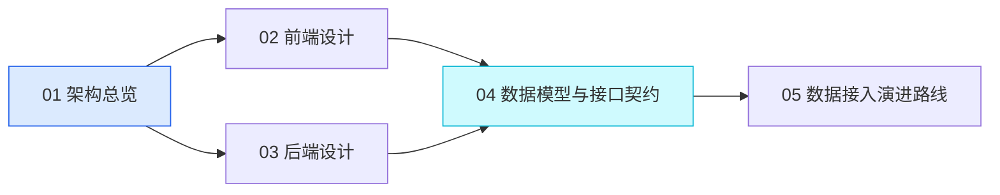

# OpenAN 社区运营洞察平台 · 架构设计文档

本目录是 **OpenAN Community Operation Insights（社区运营洞察平台）** 的架构设计文档集。

**当前状态**：设计阶段。工作区中尚无代码工程，本目录为唯一交付物。
**文档版本**：v1.0 ｜ **最后更新**：2026-09-18

---

## 1. 项目一句话说明

一个面向 OpenAN 社区运营团队的**数据看板网站**，由一个顶部导航栏与三个内容页组成，用于集中呈现社区规模指标、各成员单位的贡献度，以及历次会议信息。

| 页面 | 路由 | 核心内容 |
| --- | --- | --- |
| 首页 | `/` | 社区伙伴数量、外部开发者数量、参加的会议、应用案例、下一次会议、贡献的组织 |
| 社区活跃度情况 | `/activity` | 按组织汇总的 PR / Issue / 代码量，以及需求 / best-practice 案例 / 局点 |
| 参会情况 | `/meetings` | 会议时间线（名称、时间、地点、官网）+ 每场会议的详情表格 |

---

## 2. 文档索引

| 文档 | 内容 | 主要读者 |
| --- | --- | --- |
| [01-architecture-overview.md](./01-architecture-overview.md) | 系统上下文、分层架构、技术选型与理由、架构原则、部署形态、目录与命名约定、风险登记 | 所有人、评审者 |
| [02-frontend-design.md](./02-frontend-design.md) | 路由设计、三页面区块拆解与**字段级清单**、组件树、TanStack Query 缓存策略、设计系统、响应式与主题 | 前端工程师、设计师 |
| [03-backend-design.md](./03-backend-design.md) | NestJS 模块划分、分层职责、**Provider 端口接口签名**、DI Token 与切换方式、JSON 仓储原子写、DTO、错误码表、日志规范 | 后端工程师 |
| [04-data-and-api-contract.md](./04-data-and-api-contract.md) | **JSON 数据模型 schema**、实体字段定义、完整数据样例、**REST 接口契约**、契约治理 | 前后端工程师（必读） |
| [05-integration-roadmap.md](./05-integration-roadmap.md) | GitHub / Confluence 采集设计、增量与限流策略、调度与缓存、数据校验与回滚、里程碑与验收标准 | 后端工程师、运营负责人 |

### 2.1 推荐阅读路径

```text
新加入的工程师：README → 01 → 04 → （前端）02 / （后端）03
参与评审者   ：README → 01（重点看第 6、7 章：选型理由与架构原则）
运营负责人   ：README → 01 第 2 章 → 05 第 1、7 章（演进路线与里程碑）
数据源对接人 ：README → 04 第 3 章（字段口径）→ 05 第 2、3 章（采集设计）
```

### 2.2 依赖关系



**04 文档是唯一契约来源**：任何字段新增、改名、类型变更，都必须先改 04，再改代码。

---

## 3. 技术栈速览

| 层次 | 选型 |
| --- | --- |
| 前端 | React 18 + TypeScript + Vite 5 + React Router 6 + TanStack Query 5 + Tailwind CSS 3.4 + Recharts |
| 后端 | NestJS 10 + TypeScript + class-validator |
| 数据存储 | **JSON 文件**（`data/*.json`），通过 `JsonRepository` 抽象封装 |
| 外部数据源 | GitHub（GraphQL 为主）、Confluence（CQL 检索）——**本期仅定义端口，不实现调用** |

### 3.1 架构核心思想

**端口-适配器（Ports & Adapters）**：业务层只依赖 `Port` 接口，具体数据源由 DI Token 绑定。因此"本阶段用 JSON 硬编码、后续换真实数据源"只需修改一个模块中的绑定，**Controller、DTO、前端全部不动**。

```text
Controller → Service → Port（接口）→ Adapter（Json / Github / Confluence）→ 数据源
                          ↑
                  切换点仅在此处（ProvidersModule）
```

---

## 4. 本期范围（重要）

### 4.1 本期做什么

- ✅ 输出本目录下的五篇架构设计文档
- ✅ 定义完整的数据模型与接口契约，字段按**真实数据源语义**设计
- ✅ 定义 GitHub / Confluence 的接入端口与演进路线

### 4.2 本期不做什么

- ❌ 不创建前端或后端工程脚手架，不编写业务代码
- ❌ 不实现真实的 GitHub / Confluence 调用
- ❌ 不引入数据库、缓存中间件、消息队列
- ❌ 不做登录鉴权与后台管理界面
- ❌ 不做国际化多语言

### 4.3 「硬编码」的实现约定

需求中提到的"暂时硬编码"，在本架构中统一落在**后端 `data/*.json` 种子文件**，而不是前端组件常量。前端从第一天起就通过 HTTP 获取所有数据。

**原因**：若一部分数据走接口（如"贡献的组织"）、一部分写死在前端，后续接入真实数据时会出现两套数据路径，前端需要全面返工。统一后置到后端，使前端代码即为最终形态。

| 数据 | 位置 | 当前来源 | 未来来源 |
| --- | --- | --- | --- |
| 首页四项指标 | `data/home.json` | 人工维护 | 聚合自贡献数据 |
| 下一次会议 | `data/home.json` → `nextMeetingId` | 人工维护 | 自动推导（未结束会议中最近一场） |
| 贡献的组织 | `data/organizations.json` | 人工维护 | 同左 |
| PR / Issue / 代码量 | `data/contributions.json` | 人工维护 | **GitHub API** |
| 需求 / best-practice / 局点 | `data/insights.json` | 人工维护 | **Confluence API** |
| 会议时间线与详情 | `data/meetings.json` | 人工维护 | 同左（人工维护） |

---

## 5. 术语表

| 术语 | 英文 / 字段 | 定义 |
| --- | --- | --- |
| **社区伙伴** | Partner | 与 OpenAN 社区签署共建协议的单位（企业/机构）。对应 `Organization.type = 'partner'` |
| **外部开发者** | External Developer | 以个人身份参与社区贡献的开发者，不代表任何单位。对应 `Organization.type = 'external'` |
| **社区组织** | Community Org | 社区自身的运营与维护组织。对应 `Organization.type = 'community'` |
| **应用案例** | Use Case | 基于 OpenAN 能力构建并对外发布的实践案例，计入首页 `useCaseCount` |
| **需求** | Requirement | 在 Confluence 中登记的功能或适配需求，按条数统计 |
| **best-practice 案例** | Best Practice | 经过验证、可被其他单位复用的最佳实践文档 |
| **局点** | Deployment / Site | 需求在客户侧完成部署并稳定运行的实例。同一需求在多个局点落地时**分别计数** |
| **代码量** | Lines Changed | PR 的 `additions + deletions` 累加值，排除二进制与生成代码 |
| **下一次会议** | Next Meeting | `endDate` 最晚且尚未结束的会议；无未来会议时为 `null` |
| **贡献的组织** | Contributing Organizations | 首页展示的组织卡片墙，仅展示有贡献记录的组织 |
| **端口 / 适配器** | Port / Adapter | 架构模式：Port 是接口定义，Adapter 是具体数据源实现 |
| **契约** | Contract | 由 04 文档定义的字段与接口规范，前后端共同遵守 |

---

## 6. 关键设计决策速查

| 决策 | 结论 | 一句话理由 |
| --- | --- | --- |
| 后端框架 | NestJS（非 Express） | DI 容器让数据源切换成本降到最低 |
| 存储 | JSON 文件 + Repository 抽象 | 数据量小、零依赖、可平滑替换为数据库 |
| 前端数据获取 | 全部走后端接口 | 避免后续接入真实数据源时全面返工 |
| 字段命名 | 按真实数据源语义命名 | 避免阶段三字段改名引发前后端连锁修改 |
| 响应格式 | 统一 `{ code, message, data }` | 后续加分页/错误码不破坏前端解析 |
| 读写关系 | 采集写、接口读 | GitHub 不可用时看板仍可用 |
| GitHub API | GraphQL 为主 | 消除 N+1，一次拿到 `additions`/`deletions` |
| 契约变更入口 | 先改 04 文档 | 保证文档是唯一事实来源 |

---

## 7. 后续待办

| # | 事项 | 负责方 | 关联文档 |
| --- | --- | --- | --- |
| 1 | 按 04 文档创建 `data/*.json` 种子数据 | 后端 + 运营 | 04 第 4 章 |
| 2 | 搭建前端工程并按 02 文档实现三个页面 | 前端 | 02 |
| 3 | 搭建后端工程并按 03 文档实现模块与端口 | 后端 | 03 |
| 4 | 产出 GitHub 作者 ↔ `orgId` 映射清单 | 运营 | 05 第 2.6 节 |
| 5 | 规范 Confluence 标签与"所属组织"字段 | 运营 | 05 第 3 章 |
| 6 | 确认部署形态与 `data/` 持久化方案 | 运维 | 01 第 8 章 |

---

## 8. 文档维护约定

- 本目录文档与代码**同仓库、同评审**，遵循"文档先行"原则。
- 修改契约（字段、接口、错误码）时，必须同步更新 04 文档，并在本文档第 2 节的版本记录中登记。
- 文档内所有 Mermaid 图与表格若与实际实现不一致，以**文档为准**发起修正讨论，不允许实现单方面偏离。

| 版本 | 日期 | 变更 |
| --- | --- | --- |
| v1.0 | 2026-09-18 | 初始版本：五篇文档建立，覆盖架构、前端、后端、契约与接入演进 |
